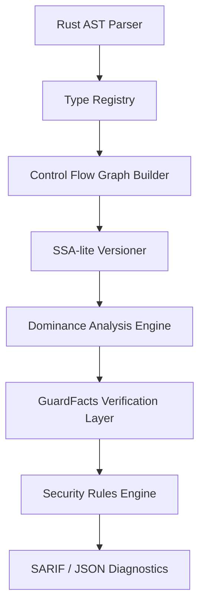

# EPIC

<p align="center">
  <b>A static analysis engine for Anchor programs.</b>
</p>

<p align="center">
  <a href="https://crates.io/crates/epic"></a>
  <a href="https://github.com/epic-sec/epic/releases"></a>
  <a href="https://github.com/epic-sec/epic/actions"></a>
  <a href="LICENSE"></a>
</p>

---

## What EPIC Is

EPIC is a compiler front-end for Anchor programs. It parses your Rust source with `syn`, builds a per-instruction control-flow graph, converts it to SSA form, and computes a dominator tree over it — the same machinery a real compiler uses, pointed at security properties instead of codegen.

That lets EPIC answer a question a text-matching linter can't: not just *"does a signer check exist somewhere in this function,"* but *"does that check dominate the privileged write"* — i.e. does every path from function entry to the write pass through the check, or can the write be reached around it. The `dominance-bypass` / `dominance-safe` fixture pair in the test suite exists specifically to prove this distinction: both contain a signer check; only one of them actually guards the write.

When `EPIC-SEC-002` (signer verification) reports a finding, it doesn't just assert a bypass — it attaches a **witness**: the concrete control-flow path from function entry to the flagged write, and, when a check exists at all, where it sits relative to that path. SARIF output carries this as a real `codeFlows` entry, not text appended to a message.

**Current state:** v0.4.0, `cargo install epic`, 7 rules, 224 findings across a pinned 5-protocol production sweep (Marginfi, Mango-v4, Orca Whirlpools, Squads-v4, Marinade), and a vendored, pinned, publicly checked-in scorecard against the `coral-xyz/sealevel-attacks` benchmark (2 of 11 vulnerability classes caught — see [Benchmarks](#benchmarks) below, false negatives and coverage gaps included, not just the wins).

---

## The Problem

Anchor's type system (`Signer<'info>`, `Account<'info, T>`, `#[account(...)]` constraints) declaratively closes most of the easy account-validation bugs for free. What it doesn't cover — an imperative check that exists in the code but doesn't actually guard the operation it's meant to protect, a signer check that runs after the write instead of before it, a check that exists on the wrong branch — is exactly the gap between "a check is present" and "a check dominates." EPIC targets that gap.

```bash
$ epic audit ./my-anchor-program

EPIC-SEC-002 [CRITICAL] programs/vault/src/lib.rs:41
  Privileged write to `vault.balance` is not dominated by a signer check.
  Witness:
    entry -> lib.rs:38 (if authority.key() != vault.authority { ... })  [does not cover this path]
    lib.rs:41 vault.balance = new_balance   <- unguarded write
```

---

## Core Capabilities

- **Interprocedural dominance analysis**: CFG + SSA + dominator tree per instruction, with call-graph summaries so a check performed in a helper function is still recognized as covering its caller.
- **Witness-backed findings**: `EPIC-SEC-002` findings carry the actual bypassing control-flow path, not just a boolean.
- **7 security rules** covering owner verification, signer verification, post-CPI staleness, PDA seed collisions, PDA derivation/bump canonicality, arbitrary CPI targets, and token account mint/authority constraints — see [`docs/rules_reference.md`](docs/rules_reference.md).
- **SARIF and JSON output** for CI integration, including structured `codeFlows` for witness-carrying findings.
- **A GitHub Action** that runs the audit natively in CI (see below).

---

## Installation

Install the EPIC CLI via Cargo:

```bash
cargo install epic
```

**Build from source (alternative):**
```bash
git clone https://github.com/epic-sec/epic.git
cd epic
cargo install --path crates/epic
```

Verify your installation:

```bash
epic doctor
```

---

## Quick Start

Audit a workspace for security vulnerabilities:

```bash
epic audit ./my-anchor-program
```

Run quick syntax/AST checks without full semantic analysis:

```bash
epic check ./my-anchor-program
```

Explain a specific rule:

```bash
epic explain EPIC-SEC-002
```

---

## Architecture



1. **Parser**: parses Rust source with `syn` — no compiled build output (`target/idl/*.json`) required.
2. **Type Registry**: resolves struct/enum/generic declarations across the workspace.
3. **CFG Builder**: one control-flow graph per instruction entry point, including `require!`/`assert!`-family desugaring into real conditional branches.
4. **SSA-lite Versioner**: each reassignment gets a new version, so dataflow tracking doesn't get confused by shadowing.
5. **Dominance Analysis Engine**: computes which blocks dominate which — the mechanism behind "does this check actually guard this write."
6. **GuardFacts Layer**: extracts security-relevant facts (owner checks, signer checks, constraints) from AST and CFG and propagates them through dominance intervals.
7. **Rules Engine**: evaluates the 7 rules against dominance graphs, type paths, and GuardFacts.
8. **Output**: human-readable, JSON, or SARIF (with `codeFlows` for witness-carrying findings).

Full detail: [`docs/ARCHITECTURE.md`](docs/ARCHITECTURE.md).

---

## Benchmarks

### Sealevel Attacks (synthetic)

EPIC's rules are checked against a vendored, pinned copy of `coral-xyz/sealevel-attacks` (pinned commit `24555d044802db4022112a94d6d70e74291a4b6d`), covering all 11 published Solana vulnerability classes. Re-runnable via `benchmarks/sealevel/run.sh`; the classified, hand-verified scorecard is checked in at [`benchmarks/sealevel/RESULTS.md`](benchmarks/sealevel/RESULTS.md).

**Score: 2 TRUE POSITIVE / 2 FALSE NEGATIVE / 7 NOT COVERED / 0 FALSE POSITIVE / 1 FLAGGED — WARNING (not a clean pass).**

Published deliberately including the misses: 7 of the 11 classes (account-data-matching, type-cosplay, initialization, duplicate-mutable-accounts, pda-sharing, closing-accounts, sysvar-address-checking) have no rule targeting them at all today. That's not a scanner claiming to catch everything — it's what the 2 classes it does catch are worth, stated against the 9 it doesn't.

### Real-world sweep

224 findings across a pinned 5-protocol production corpus: Marginfi, Mango-v4, Orca Whirlpools, Squads-v4, Marinade. A 6th protocol (metaplex-mpl) was measured and dropped from the corpus — it's a Shank-based native program, not Anchor, and its results were dominated by a naming collision rather than real signal (see Known Limitations).

---

## Known Limitations

Full detail: [`KNOWN_LIMITATIONS.md`](KNOWN_LIMITATIONS.md). Three systemic false-positive classes were found and fixed in past releases:

1. **PDA bump false positive**: canonical stored-bump patterns (`bump = <account>.bump`, Marinade's `_bump_seed` convention) were flagged as caller-supplied. Fixed.
2. **`require!`/`assert!` blindness**: checks written via `require!`, `require_eq!`, `assert!`, etc. didn't desugar into real CFG branches, so dominance analysis couldn't see them — a real check looked like a missing one. Fixed by adding CFG desugaring for the whole `require!`/`assert!` family.
3. **Owner-check reference-unwrap bug**: `account.owner != &spl_token::ID` — a very common idiom — stringified to `"unknown"` internally and could never match the expected-owner whitelist. Fixed.

Open, documented (not fixed) gaps include: a struct-literal field-name collision in the authority-like-symbol scan (a field literally named `authority` populated from an unrelated account can be misread as an unchecked account), and `EPIC-SEC-TOKEN` never analyzing the instruction handler body (sampled 10 findings across 4 protocols: 0 true positives by its own claim, 6 backed by a real but imperative check it can't see, 4 requiring no constraint at all). Two fixes were implemented, measured, and reverted rather than shipped — a mutation-gate widening that fixed 2 false negatives but produced 100+ new findings dominated by author-annotated `/// CHECK:` accounts, and an `EPIC-SEC-TOKEN` keyword fix that silently flipped 18 true positives to false negatives on Orca Whirlpools. Both are documented with the measured numbers rather than shipped quietly.

**Architectural finding worth knowing before extending this further**: interprocedural signer-check dominance — the mechanism `EPIC-SEC-002` is built on — has real, measured payoff against the synthetic Sealevel benchmark, but close to zero incremental payoff against real Anchor code, because `Signer<'info>` already gives the same guarantee declaratively at parse time for free. Across the 5-protocol sweep, only 2 non-empty interprocedural guard summaries were ever found, and both resolved to accounts already provably safe via the type system. The same call-graph/summary/wiring machinery has no declarative-type-system shortcut competing with it when pointed at discriminator/type confusion, arithmetic correctness, or post-CPI staleness instead — that's the more promising target for the next build, not further investment in signer dominance specifically.

---

## GitHub Action Integration

Integrate EPIC into your CI pipeline using the official GitHub Action. It runs the audit and comments with a markdown/SARIF report.

Add the following to `.github/workflows/epic.yml`:

```yaml
name: EPIC Security Audit
on:
  pull_request:
    branches: [ main ]

jobs:
  audit:
    runs-on: ubuntu-latest
    steps:
      - uses: actions/checkout@v4

      - name: EPIC Security Audit
        uses: epic-sec/epic/github-action@main
        with:
          path: '.'
          format: 'sarif'
```

> **Note:** First-time Action runs may take ~90 seconds since EPIC currently compiles from source. Pre-compiled binaries are planned for a future release to speed this up.

---

## ABI / Upgrade Compatibility Diff (secondary feature)

EPIC also ships an `epic diff` command that compares two versions of a workspace and classifies account layout changes as `SAFE`, `MIGRATION REQUIRED`, or `BLOCKED`, to catch upgrades that would silently corrupt existing on-chain account data:

```bash
$ epic diff ./old-program ./new-program

Verdict   [ BLOCKED ]  Existing accounts would be corrupted
Size      40 → 48 bytes (+8)
WHY       Field inserted in the middle — every field after it shifts on disk.
```

**This is a secondary feature, not the main thing this project does, and its accuracy validation currently does not run.** `crates/epic/tests/validation_harness.rs::test_historical_upgrades_harness` — which checks the diff engine's verdicts against real historical upgrade commits from Squads-v4, Marginfi, and Drift — is `#[ignore]`d in CI: it depends on local clones (`/Users/aksh/epic-test-repos/*`) that aren't vendored in this repo, so every case fails to load and the harness fails closed rather than validating anything. It can be run manually with those clones present via `cargo test -- --ignored test_historical_upgrades_harness`, but until it's made self-contained and turned back on in CI, treat `epic diff`'s accuracy as unverified rather than measured — unlike the audit engine above, which has a checked-in, reproducible scorecard.

---

## Roadmap

The signer-dominance architectural finding above (see Known Limitations) points at the next targets more precisely than a version-number roadmap would: discriminator/type confusion detection, arithmetic correctness (overflow/precision loss in balance math), and post-CPI staleness are the properties Anchor's type system doesn't give you for free, and where the interprocedural machinery already built has real, non-redundant room to apply. Also planned: resolving the struct-literal field-name collision documented above, and extending `EPIC-SEC-TOKEN` to analyze handler bodies instead of only declarations. Making the ABI diff engine's historical-upgrade validation harness self-contained (vendoring real before/after snapshots instead of depending on local clones) is a prerequisite before its accuracy claims can be trusted the way the audit engine's now are.

---

## Contributing

We welcome contributions! Please see our issue tracker for open issues or submit a pull request. Make sure you run `epic doctor` to verify your environment setup before building.

---

## License

This project is licensed under the MIT License.
